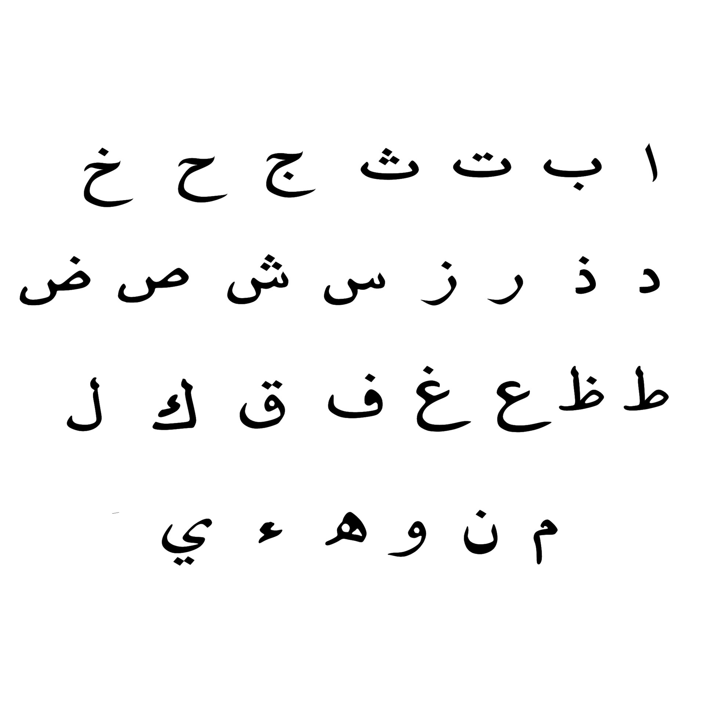

# Hijaiyah Audio Classification
---

## Machine Learning Team 
| [ Giovaldi Ramadhan](https://github.com/giovaldir)  | [ Mujadid Syahbana](https://github.com/mujadidsyahbana)  | [ Wilbert Tanumihardja](https://github.com/WTanumihardja)  | 
| :---: | :---: | :---: |

## Introduction

This feature focuses on developing a Audio Classification system using machine learning techniques. The goal is to accurately identify Hijaiyah letters to help customers learn about Arabic Alphabet and how to pronounce it right .

All models link: https://drive.google.com/drive/folders/12eklYCcZ_X8WhCX4gqSNuZLwpvS2EP23?usp=sharing

## Table of Contents

- [Dataset](#dataset)
- [Project Steps](#project-steps)
- [Results](#results)
- [Reference](#reference)

## Dataset

The dataset used for this project contains Arabic Alphabet (Hijaiyah) audio files with a .wav format. It consists of 29 alphabets (~ 140 audio each). 

Dataset link: https://drive.google.com/drive/folders/1GXyFO6LGBgO-FNRjDIu5fRALkoAb2en2

## Project Steps

The project follows these steps:

1. Data Collection: Import Packages, Load Data, and Data Labelling.
1. Data Preprocessing: Feature Extraction using MFCC & Spectogram, and encode categorical variables.
2. Exploratory Data Analysis: Understand the distribution of audio data, identify patterns and correlations between all Hijaiyah Alphabet.
3. Architecture Modeling: Implement appropriate classification models for Audio Classification, such as CNN and LSTM model (adding more convolutional layers, increasing the number of filters, or including additional pooling or dropout layers) and apply Regularization techniques to prevent Overfitting
5. Model Training and Evaluation: Train the selected models and evaluate their performance using metrics of accuracy.
6. Model Comparison: Compare the results of different models to identify the most effective combination.

## Results

The best performing model for this project is the CNN combined with MFCC and Spectogram technique. This combination achieved a Training loss: 0.0569 - accuracy: 0.9843 and val_loss: 0.2084 - val_accuracy: 0.9433, indicating its effectiveness in accurately identifying Hijaiyah Alphabet.

## Train vs Validation

## Prediction

## Reference
https://www.mdpi.com/2076-3417/11/6/2508

