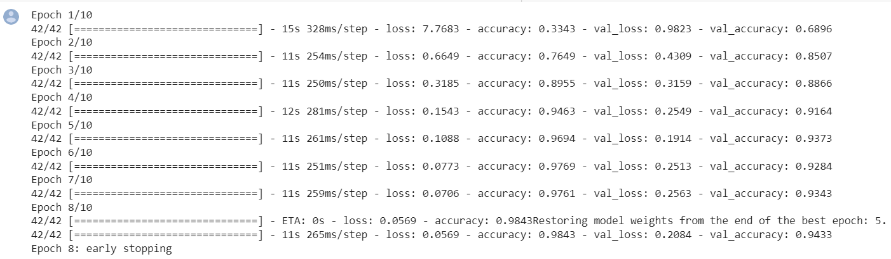
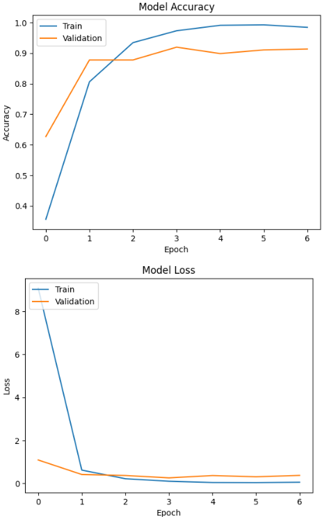
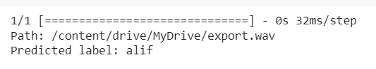

# Hijaiyah Audio Classification
---

## Machine Learning Team 
| [ Giovaldi Ramadhan](https://github.com/giovaldir)  | [ Mujadid Syahbana](https://github.com/mujadidsyahbana)  | [ Wilbert Tanumihardja](https://github.com/WTanumihardja)  | 
| :---: | :---: | :---: |

## Introduction

This feature focuses on developing a Audio Classification system using machine learning techniques. The goal is to accurately identify Hijaiyah letters to help customers learn about Arabic Alphabet and how to pronounce it right .

All models link: https://drive.google.com/drive/folders/12eklYCcZ_X8WhCX4gqSNuZLwpvS2EP23?usp=sharing

## Table of Contents

- [Dataset](#dataset)
- [Project Steps](#project-steps)
- [Training and Evaluation Results](#training-and-evaluation-results)
- [References](#references)

## Dataset

The dataset used for this project contains Arabic Alphabet (Hijaiyah) audio files with a .wav format. It consists of 29 alphabets (~ 140 audio each). 

- Audio Dataset link: https://drive.google.com/drive/folders/1nEHE705xw6s9V3rrRKZF3Sthk3J5a-23?usp=drive_link
- CSV Dataset link: https://drive.google.com/drive/folders/1GXyFO6LGBgO-FNRjDIu5fRALkoAb2en2

## Project Steps

The project follows these steps:

1. Data Collection: Import Packages, Load Data, and Data Labelling.
1. Data Preprocessing: Feature Extraction using MFCC & Spectogram, Feature Scaling, and encode categorical variables.
2. Exploratory Data Analysis: Understand the distribution of audio data, identify patterns and correlations between all Hijaiyah Alphabet.
3. Architecture Modeling: Implement appropriate classification models for Audio Classification, such as CNN and LSTM model (adding more convolutional layers, increasing the number of filters, or including additional pooling or dropout layers) and apply Regularization techniques to prevent Overfitting
5. Model Training and Evaluation: Train the selected models and evaluate their performance using metrics of accuracy.
6. Model Comparison: Compare the results of different models to identify the most effective combination.

## Training hyperparameters
The following hyperparameters were used during training:

- patience=3
- verbose=1
- batch_size=32
- epochs=10
- monitor='val_loss'
- random_state=42

In our case, various hyperparameters were employed during training to optimize the model's performance. A patience of 3 was set, allowing the training to continue for additional epochs if the validation loss did not improve. The verbosity level was set to 1, providing detailed progress updates during training. A batch size of 32 was selected, determining the number of audio samples processed in each iteration, balancing computational efficiency and memory usage. The training process was conducted for 10 epochs, representing the number of times the entire dataset was passed through the model. The "val_loss" metric was monitored to determine when to halt training based on validation loss. Finally, a random state of 42 was specified, ensuring reproducibility of the results across different runs. These hyperparameters were carefully chosen and adjusted to enhance the audio classification model's accuracy and generalization capabilities.

## Training and Evaluation Results

### Train vs Validation Visualization

Overall, the CNN model performs well and shows improvement in both training and validation metrics throughout the epochs. The training loss and validation loss decrease significantly from the initial epoch, indicating that the model is learning and reducing its errors. The training accuracy and validation accuracy also increase, suggesting that the model's predictions are becoming more accurate.

After the seventh epoch, early stopping is applied, likely because there is no significant improvement in the validation loss. The final test results show a test loss of 0.3699 and a test accuracy of 0.9134, which indicates that the model generalizes well to unseen data.

### Prediction Results

The above results indicate that the model is running well, where the model receives input in the form of new audio recordings in .wav format and can generate accurate predictions.

## References
- https://www.mdpi.com/2076-3417/11/6/2508
- https://ieeexplore.ieee.org/document/10085647/
- https://www.researchgate.net/publication/309711159_An_Enhanced_Arabic_Phonemes_Classification_Approach
